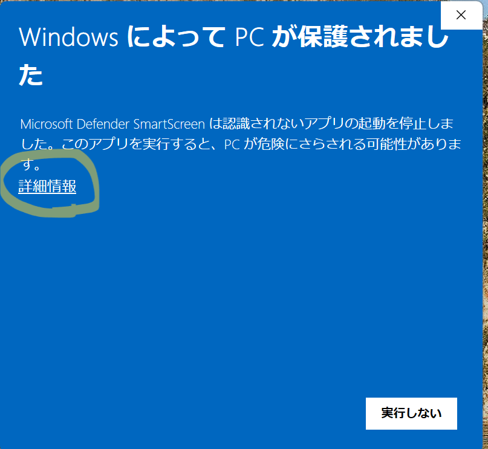
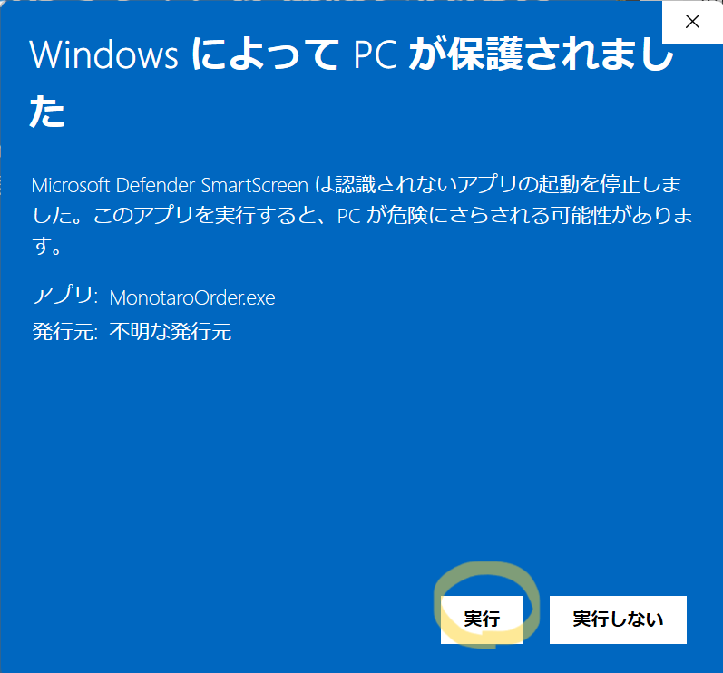

# 🛒 モノタロウ注文情報Excel作成ツール

> モノタロウの商品URLから商品情報を自動取得し、Excel形式の注文リストを作成するGUIアプリケーション

---

## 📋 目次

1. [概要](#-概要)
2. [主な機能](#-主な機能)
3. [使い方](#-使い方)
4. [注意事項](#-注意事項)
5. [開発者向け情報](#-開発者向け情報)

---

## 🎯 概要

このツールを使用すると、モノタロウ（MONOTARO）の商品ページURLを入力するだけで、商品情報を自動的に取得し、注文用のExcelファイルを簡単に作成できます。

---

## ✨ 主な機能

### 1️⃣ 商品情報の自動取得
モノタロウの商品ページURLから以下の情報を自動抽出します：
- 🏢 仕入元（モノタロウ）
- 🔢 商品コード
- 📦 商品名
- 🏷️ 型番
- 💰 単価（税別）
- 💴 価格（税込）

### 2️⃣ Excel出力機能
- ✅ 新規Excelファイルの作成
- ✅ 既存Excelファイルへの追加

### 3️⃣ 複数商品の一括処理
- ✅ URLリストに複数の商品を追加して一括変換
- ✅ 各商品の個数を指定可能
- ✅ 自動で合計金額を計算

---

## 📖 使い方

### ステップ1️⃣：アプリケーションのダウンロードと起動

#### ダウンロード手順
1. GitHubページの右側にある **「Release」** を選択
2. 最新バージョンの `monotaroOrder.exe` をダウンロード
3. ダウンロードしたファイルをデスクトップなど任意の場所に保存
4. ダブルクリックで起動

#### ⚠️ セキュリティ警告について
初回起動時、以下のような警告が表示される場合があります：

<div style="display:flex;gap:8px;align-items:flex-start;">
  
  
</div>

**対処方法：**
1. 「詳細表示」をクリック
2. 「実行」ボタンをクリック

---

### ステップ2️⃣：モード選択

GUIが起動したら、作業モードを選択します。

| モード | 説明 |
|--------|------|
| 🆕 **新規作成** | 新しいExcelファイルを作成します |
| ➕ **既存ファイルに追加** | 既存のExcelファイルに商品を追記します（既存内容の下に追加） |

---

### ステップ3️⃣：ファイル設定

#### 🆕 新規作成の場合
1. 「ファイルパス」の **「参照」** ボタンをクリック
2. 保存先とファイル名を指定（例：`注文リスト.xlsx`）
3. 「シート名」を入力（デフォルト：`注文内容`）

#### ➕ 既存ファイルに追加の場合
1. 「ファイルパス」の **「参照」** ボタンをクリック
2. 追加したい既存のExcelファイルを選択

---

### ステップ4️⃣：商品情報の入力

1. **モノタロウ商品URL** を入力
   - ⚠️ **重要：** 型番まで指定したURLを使用してください（指定しないとエラーになります）
   - 📌 例：`https://www.monotaro.com/p/1234/5678/`

2. **個数** を入力（デフォルト：1）

3. 「リストに追加」ボタンをクリック

---

### ステップ5️⃣：複数商品の追加（オプション）

必要に応じて、ステップ4を繰り返して複数の商品をリストに追加できます。

#### リスト管理機能
- 🗑️ **選択項目を削除**：リストから特定の商品を削除
- 🧹 **リストをクリア**：リスト内のすべての商品を削除

---

### ステップ6️⃣：変換実行

「変換実行」ボタンをクリックすると、以下の処理が実行されます：

1. 各商品の情報を順次取得（進捗バーが表示されます）
2. 取得完了後、自動的にExcelファイルに書き込み
3. 完了メッセージが表示されたら完了 ✅

---

### ステップ7️⃣：Excelファイルの確認

出力されたExcelファイルには、以下の情報が含まれます：

| 仕入元 | 商品コード | 商品名 | 型番 | 単価 | 数量 | 合計 | URL | 価格(税込) |
|:------:|:----------:|:------:|:----:|:----:|:----:|:----:|:---:|:----------:|
| モノタロウ | xxxxxx | 〇〇〇 | △△△ | ¥xxx | x | ¥xxx | URL | ¥xxx |

---

## ⚠️ 注意事項

### 利用時の注意点

#### 🔄 情報取得の確実性について
- Webページの構造変更により、情報が取得できない場合があります
- エラーが発生した場合の対処法：
  1. 管理者に報告
  2. GitHubのIssueで報告
  3. プログラムを修正してプルリクエストを送信

#### 📂 Excelファイルが開けない場合
以下の点を確認してください：
- ✅ ファイルが他のアプリケーションで開かれていないか
- ✅ 書き込み権限があるフォルダに保存しているか

---

## 👨‍💻 開発者向け情報

### 📦 必要なライブラリ

`.exe`ファイルを使わずにPythonスクリプトとして実行する場合は、以下のライブラリが必要です。

```powershell
# 必要なライブラリを一括インストール
pip install openpyxl requests beautifulsoup4
```

---

### 🔧 プログラムの拡張

新しい機能を追加したい場合は、以下のいずれかの方法で貢献できます：
1. 新規でプログラムを作成し、GitHubでプルリクエストを送信
2. 直接コードを共有

---

### 🏗️ プログラムを.exe化する方法

#### `build.bat`の使い方

1. `monotaro.py` を編集
2. `build.bat` を実行（右クリックして「開く」）
3. `monotaro.py` が `.exe` ファイルに変換されます

#### ⚠️ リリース前の確認事項
- 作成した `.exe` ファイルが正しく動作することを検証
- 動作確認後、GitHubのリリースページにアップロード

---

## 📝 ライセンス・お問い合わせ

ご質問や不具合の報告は、GitHubのIssueページまでお願いします。